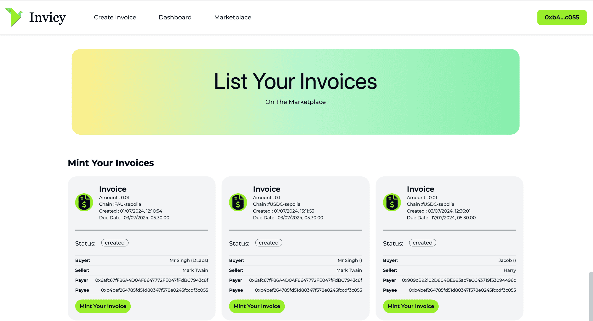

# Introducing Invisy

One stop platform to create, cancel approve, pay, manage, lend and borrow invoices.

## **🌐 Links**
**Demo App:** [https://invisy.vercel.app/](https://invisy.vercel.app/)

**Demo Video:**
[](https://drive.google.com/file/d/1t2V1FYT9LOCABsH6TnnvvoWiGSzjB07J/view?usp=sharing)

**Invoice Marketplace Contract (Sepolia)** : </br>
Old contract - 0x1b777b2CEBf0DBa2FBBa7c2E55911F5b5032242F </br>
New contract - 0x38a547cFD6Dc5a2335d54B245406ffB221681558

### Screenshots of the current Web App

**Main Marketplace Page**


**Dashboard Page**


**Create Invoice Page**


**Mint Invoice Page**



## **🧐 Problem Statement**
**1. Inefficiency in Invoice Management**
Managing invoices is a time-consuming and error-prone process for businesses, often requiring multiple steps and involving various intermediaries. This inefficiency can lead to delayed payments, lost invoices, and increased administrative costs.

**2. Cash Flow Challenges**
Businesses, especially small and medium enterprises (SMEs), frequently face cash flow issues due to delayed payments. Traditional invoice factoring and financing solutions are often costly and involve lengthy approval processes.

**3. Lack of Transparency and Security**
Traditional invoicing systems lack transparency, making it difficult for businesses to track the status of invoices and payments. Additionally, these systems are vulnerable to fraud and data breaches.

**4. Limited Access to Financing**
Small businesses often struggle to access financing due to stringent requirements and lack of collateral. Traditional financial intermediaries impose high fees and interest rates, making financing expensive and less accessible.

## **💡 Idea / Solution**

### **Invisy: A Decentralized Invoice Management Platform**

Invisy leverages the power of blockchain technology and the Request Network to provide a comprehensive solution for invoice management. By tokenizing invoices as NFTs, Invisy facilitates a transparent, secure, and efficient ecosystem for creating, canceling, approving, paying, managing, lending, and borrowing invoices.

### **How Invisy Works**
- Tokenization of Invoices: Invoices are converted into Non-Fungible Tokens (NFTs) on the blockchain, ensuring immutability and traceability.

- Decentralized Marketplace: Businesses can list their invoice NFTs on a decentralized marketplace, where investors can purchase them, providing immediate liquidity.

- Smart Contracts: Automated smart contracts using Request Network handle the creation, transfer, and settlement of invoices, reducing the need for intermediaries and minimizing human error.


## **Features**

- **Create and Tokenize Invoices:** Easily create invoices and tokenize them as NFTs on the blockchain.
- **Cancel and Approve Invoices:** Secure mechanisms for canceling and approving invoices, ensuring accurate record-keeping.
- **Payment Tracking:** Real-time tracking of invoice payments for transparency and accountability.
- **Marketplace Listing:** List invoice NFTs on the Invisy marketplace for a global network of investors.
- **Invoice Factoring:** Sell invoices to investors at a discount to receive immediate cash flow.
- **Immutable Records:** Blockchain ensures that all invoice data is secure, immutable, and transparent.
- **Smart Contract Automation:** Automated processes for invoice creation, transfer, and payment settlement.
- **Immediate Liquidity:** Quickly access funds by selling invoices, enhancing cash flow management.
- **User-Friendly Dashboard:** Manage invoices, track payments, and monitor investments with ease.
- **Web3 Integration:** Seamless integration with blockchain wallets (e.g., MetaMask) for easy access.

## **🚀 Tech Stack**

- **Blockchain:** Ethereum
- **Smart Contracts:** Solidity
- **NFT Standard:** ERC-721
- **Decentralized Finance (DeFi):** Request Network
- **Frontend:** Nextjs, Web3.js
- **Contract Testing:** Hardhat, Ethers.js
- **Version Control:** Git, GitHub  

## Install

```
npm install
```

## Run

```
npm run start
```

## Develop

```
cp .env.example .env.local
npm run dev
```

## Deploy

We deploy to an [EasyPanel](https://easypanel.io/) server using Github Actions and [Heroku Buildpacks](https://devcenter.heroku.com/articles/buildpacks). You could easily deploy to Vercel, Netlify, or any other platform.

- [deploy-to-staging.yml](/.github/workflows/deploy-to-staging.yml) - Deploy to Staging on push to `main` branch.
- [deploy-to-production.yml](/.github/workflows/deploy-to-production.yml) - Deploy to Production on release published in Github.

## Environment Variables

Before deploying, ensure you have created a `.env` or `.env.local` file in the root of your project. Below is a list of available environment variables. You can also take a look at the [.env.example](./.env.example) file for reference.

> **:warning: WARNING:** The default `PAYMENTS_SUBGRAPH_URL`s are rate-limited and should be replaced with your own subgraph URLs.

| Variable Name                                  | Description                          | Required |
| ---------------------------------------------- | ------------------------------------ | -------- |
| NEXT_PUBLIC_WALLET_CONNECT_PROJECT_ID          | Your Wallet Connect Project ID       | ✅       |
| NEXT_PUBLIC_SUPPORT_EMAIL                      | Support email address                | ✅       |
| NEXT_PUBLIC_APP_URL                            | The application URL                  | ✅       |
| NEXT_PUBLIC_RPC_URL_ETHEREUM                   | RPC URL for Ethereum                 | ✅       |
| NEXT_PUBLIC_RPC_URL_POLYGON                    | RPC URL for Polygon                  | ✅       |
| NEXT_PUBLIC_RPC_URL_SEPOLIA                    | RPC URL for Sepolia                  | ✅       |
| NEXT_PUBLIC_PAYMENTS_SUBGRAPH_URL_ARBITRUM_ONE | Subgraph URL for Arbitrum One        | ✅       |
| NEXT_PUBLIC_PAYMENTS_SUBGRAPH_URL_AVALANCHE    | Subgraph URL for Avalanche           | ✅       |
| NEXT_PUBLIC_PAYMENTS_SUBGRAPH_URL_BASE         | Subgraph URL for Base                | ✅       |
| NEXT_PUBLIC_PAYMENTS_SUBGRAPH_URL_BSC          | Subgraph URL for Binance Smart Chain | ✅       |
| NEXT_PUBLIC_PAYMENTS_SUBGRAPH_URL_CELO         | Subgraph URL for Celo                | ✅       |
| NEXT_PUBLIC_PAYMENTS_SUBGRAPH_URL_CORE         | Subgraph URL for Core                | ✅       |
| NEXT_PUBLIC_PAYMENTS_SUBGRAPH_URL_FANTOM       | Subgraph URL for Fantom              | ✅       |
| NEXT_PUBLIC_PAYMENTS_SUBGRAPH_URL_FUSE         | Subgraph URL for Fuse                | ✅       |
| NEXT_PUBLIC_PAYMENTS_SUBGRAPH_URL_MAINNET      | Subgraph URL for Mainnet             | ✅       |
| NEXT_PUBLIC_PAYMENTS_SUBGRAPH_URL_MATIC        | Subgraph URL for Matic               | ✅       |
| NEXT_PUBLIC_PAYMENTS_SUBGRAPH_URL_MOONBEAM     | Subgraph URL for Moonbeam            | ✅       |
| NEXT_PUBLIC_PAYMENTS_SUBGRAPH_URL_NEAR         | Subgraph URL for Near                | ✅       |
| NEXT_PUBLIC_PAYMENTS_SUBGRAPH_URL_NEAR_TESTNET | Subgraph URL for Near Testnet        | ✅       |
| NEXT_PUBLIC_PAYMENTS_SUBGRAPH_URL_OPTIMISM     | Subgraph URL for Optimism            | ✅       |
| NEXT_PUBLIC_PAYMENTS_SUBGRAPH_URL_RONIN        | Subgraph URL for Ronin               | ✅       |
| NEXT_PUBLIC_PAYMENTS_SUBGRAPH_URL_SEPOLIA      | Subgraph URL for Sepolia             | ✅       |
| NEXT_PUBLIC_PAYMENTS_SUBGRAPH_URL_TOMBCHAIN    | Subgraph URL for Tombchain           | ✅       |
| NEXT_PUBLIC_PAYMENTS_SUBGRAPH_URL_XDAI         | Subgraph URL for xDai                | ✅       |
| NEXT_PUBLIC_PAYMENTS_SUBGRAPH_URL_ZKSYNCERA    | Subgraph URL for ZkSyncEra           | ✅       |

## Configuration

In your next.config.js file, ensure you have the following configuration:

```javascript
/** @type {import('next').NextConfig} */
const nextConfig = {
  reactStrictMode: true,
  swcMinify: false,
};

export default nextConfig;
```

#### Explanation

This configuration ensures that the Svelte web components render correctly. The swcMinify: false setting is crucial because Svelte web components and their rendering nature can sometimes conflict with aggressive minification processes. Disabling SWC minification helps prevent potential issues with web component rendering.
